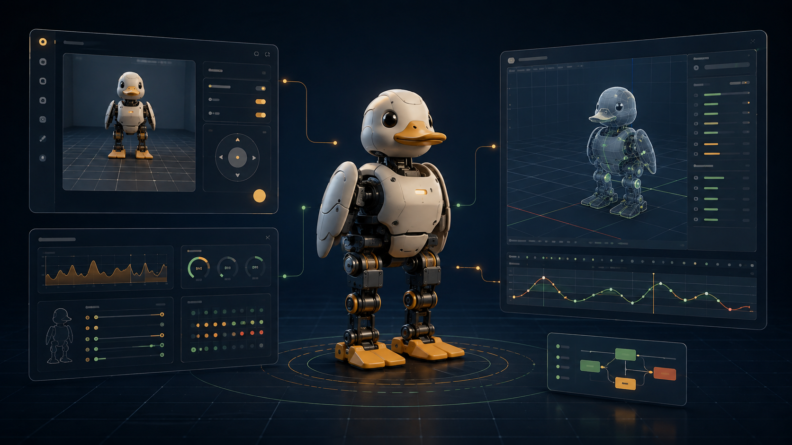

<p align="center">
  
</p>

<h1 align="center">Microduck Studio</h1>

<p align="center">A local control room for developing, simulating, and validating Microduck.</p>

<p align="center">
  <a href="README.md">English</a> · <a href="README.zh-CN.md">简体中文</a>
</p>

<p align="center">
  
  
  
  <a href="LICENSE"></a>
</p>

<p align="center">
  AI coding ready:
  <a href="https://developers.openai.com/codex/">Codex</a> ·
  <a href="https://code.claude.com/docs/en/overview">Claude Code</a> ·
  <a href="https://cursor.com/docs/agent/overview">Cursor Agent</a> ·
  <a href="https://docs.github.com/en/copilot/concepts/agents/copilot-cli/about-copilot-cli">GitHub Copilot CLI</a>
</p>

<p align="center">
  <a href="#start-with-an-ai-coding-agent">AI startup</a> ·
  <a href="#quick-start">Quick start</a> ·
  <a href="#robotctl-monitor">Monitor</a> ·
  <a href="#how-the-projects-fit-together">Architecture</a> ·
  <a href="#when-the-page-does-not-move-the-robot">Troubleshooting</a>
</p>

<p align="center">
  <sub>Concept preview — this placeholder will later be replaced by one real composite of the Web UI, <code>robotctl monitor</code>, and MuJoCo.</sub>
</p>

Microduck Studio connects the existing
[`microduck`](https://github.com/pollen-robotics/microduck) runtime and
[`microduck_rl`](https://github.com/pollen-robotics/microduck_rl) simulation/training project in
one browser-based development workflow. It presents status and safe control; it does not duplicate
robot safety, policy inference, simulator physics, or training logic.

## Start with an AI coding agent

Any local AI coding agent with repository and terminal access can start the complete stack; no
tool-specific integration is required. Supported examples include
[Codex](https://developers.openai.com/codex/),
[Claude Code](https://code.claude.com/docs/en/overview),
[Cursor Agent](https://cursor.com/docs/agent/overview), and
[GitHub Copilot CLI](https://docs.github.com/en/copilot/concepts/agents/copilot-cli/about-copilot-cli).

Open the `microduck-dev` workspace in a local session and use this prompt:

```text
Start all Microduck Studio services. First read AGENTS.md and microduck-studio/README.md. Check the
three sibling repositories, Docker, uv, and ports 7801 and 8090. Then run
./scripts/dev-stack.sh from microduck-studio. Wait for "control probe passed" before reporting the
Studio URL and the status of Studio, robotd, and MuJoCo. Do not start a training job, and do not
switch or modify the working branches of the sibling repositories.
```

> Use a local agent session with access to Docker and the desktop. A cloud or background agent can
> run in a different machine and cannot display the native MuJoCo Viewer on the development host.

## Quick start

### Requirements

- Docker with Docker Compose
- `git` and `curl`
- Python 3 and [`uv`](https://docs.astral.sh/uv/)

> The individual projects can run directly on the host and do not inherently require Docker.
> The `dev-stack.sh` launcher does require Docker because it isolates the `robotd` and Studio Web
> build and runtime environments. On macOS, Docker Desktop is one option; any compatible Docker
> runtime is suitable.

### 1. Download the three repositories

Studio is not standalone: `microduck` supplies `robotd` and its policies, while `microduck_rl`
supplies the MuJoCo body and Viewer. All three repositories must be sibling directories under one
workspace:

```text
microduck-dev/          # workspace only; not a Git repository
├── microduck/          # robotd, robotctl, policies, and runtime protocol
├── microduck_rl/       # MuJoCo body, Viewer, environments, and training
└── microduck-studio/   # Web UI and development-stack orchestration
```

For a fresh workspace, clone the repositories used by this development setup:

```bash
mkdir -p ~/microduck-dev
cd ~/microduck-dev

git clone https://github.com/ttfont/microduck.git
git clone https://github.com/ttfont/microduck_rl.git
git clone https://github.com/microai-lab/microduck-studio.git
```

Download links: [microduck](https://github.com/ttfont/microduck),
[microduck_rl](https://github.com/ttfont/microduck_rl), and
[microduck-studio](https://github.com/microai-lab/microduck-studio). The first two are development
forks of the [official runtime](https://github.com/pollen-robotics/microduck) and
[official RL repository](https://github.com/pollen-robotics/microduck_rl).

Existing repositories do not need to be cloned again; their directory layout only needs to match
the structure above.

### 2. Prepare the simulation backend

Full MuJoCo integration requires the official `microduck` `sim-remote-io` branch. The regular
runtime branch in the cloned development fork does not provide the `robotd --sim` backend; this
branch supplies the remote `RobotIo` implementation that connects `robotd` to the MuJoCo body
service at TCP `127.0.0.1:7801` by default.

Fetch it once from the workspace directory:

```bash
git -C microduck remote add upstream https://github.com/pollen-robotics/microduck.git
git -C microduck fetch upstream sim-remote-io
```

Run `remote add` only once; if `upstream` already exists, run only the second command. These
commands add the repository address and download the branch; they do not switch the current
`microduck` branch. The launcher reads `upstream/sim-remote-io` and extracts it into isolated Studio
state. If it was not fetched in advance, the launcher can also download it automatically into
`.studio-runtime/dev-stack/sim-runtime.git` without changing the sibling repository's branch or
working tree. See [How the projects fit together](#how-the-projects-fit-together) for the role of
`robotd --sim` in the full control path.

### 3. Prepare the RL environment

The native macOS Viewer runs from the `microduck_rl` virtual environment:

```bash
cd ~/microduck-dev/microduck_rl
uv sync
```

### 4. Start and verify everything

```bash
cd ~/microduck-dev/microduck-studio
./scripts/dev-stack.sh
```

Open **http://127.0.0.1:8090**. The default `native` mode starts MuJoCo in the macOS background for
smooth native OpenGL offscreen rendering without opening the desktop Viewer. A simulation-enabled
`robotd` and Studio run in Docker. The launcher then proves the complete control path by moving the
simulated robot. Do not treat a reachable page alone as ready; wait for:

```text
control probe passed: MuJoCo moved ... m
```

> The launcher never switches a sibling repository's working branch. It extracts the required
> `sim-remote-io` runtime revision into isolated Studio state.

## Capabilities

| Area | Included |
|---|---|
| Web control | Phone-friendly movement, enable/stop, sit/stand, roulade, and kicks |
| Live visibility | Browser-rendered MuJoCo scene, robot telemetry, repository/job status, and model discovery |
| Safe orchestration | Docker Compose lifecycle, an end-to-end control probe, and allowlisted RL smoke tests |

Motion uses one persistent `robotd` connection. Releasing a control, hiding the page, disconnecting,
or shutting Studio down sends `robot.stop`; `robotd` remains the final safety and motor authority.

## Daily workflow

Run these commands from `microduck-studio`:

| Goal | Command |
|---|---|
| Start or cleanly restart everything and verify control | `./scripts/dev-stack.sh` |
| Run native MuJoCo in the background (default) | `./scripts/dev-stack.sh` |
| Explicitly open the desktop MuJoCo Viewer | `./scripts/dev-stack.sh --viewer` |
| Start without the simulated movement probe | `./scripts/dev-stack.sh --skip-control-probe` |
| Stop background MuJoCo 10 s after the last page closes | `./scripts/dev-stack.sh --stop-on-browser-close` |
| Start the fully containerized CPU renderer | `./scripts/dev-stack.sh --sim-mode docker --gpu none` |
| Use Linux DRI/EGL GPU passthrough | `./scripts/dev-stack.sh --sim-mode docker --gpu dri` |
| Use Linux NVIDIA/EGL GPU passthrough | `./scripts/dev-stack.sh --sim-mode docker --gpu nvidia` |
| Check Studio, `robotd`, and MuJoCo together | `./scripts/dev-stack.sh status` |
| Open the live terminal monitor | `./scripts/dev-stack.sh monitor` |
| Stop only this development stack | `./scripts/dev-stack.sh stop` |

The `robotd` and MuJoCo status cards show Start or Restart according to connection state. These
buttons use a restricted host manager created by the launcher; it accepts only fixed service
operations. Restarting MuJoCo waits for its port and then restarts robotd as well. If the Web
service itself is down, use `./scripts/dev-stack.sh` because the buttons are not reachable.

Only `--viewer` opens the desktop window. Closing that window stops the simulator; use the Start
button on its status card to restore it. The default background mode uses the same native
authoritative world and offscreen renderer.

Add `--stop-on-browser-close` to stop only MuJoCo after the final scene WebSocket remains
disconnected for 10 seconds. A page refresh or reconnect inside that grace period cancels the
shutdown. Without this option, background MuJoCo continues until `dev-stack.sh stop`. `--headless`
remains available as an explicit compatibility spelling of the default behavior.

### Choose a rendering mode

Use the default command for a local macOS development machine. It is the only mode intended for a
smooth local demo without a Linux GPU host:

| Situation | Command | Renderer and expected result |
|---|---|---|
| macOS local development (recommended) | `./scripts/dev-stack.sh` | Native macOS offscreen OpenGL; the authoritative MuJoCo world runs in the background and the desktop Viewer stays closed. |
| Inspect the native Viewer | `./scripts/dev-stack.sh --viewer` | Opens the desktop Viewer against the same simulation service; closing it stops MuJoCo. |
| Docker Desktop on macOS or CPU-only CI | `./scripts/dev-stack.sh --sim-mode docker --gpu none` | Dockerized OSMesa software renderer. Physics and scene state remain authoritative, but the video stream can be slow. |
| Linux host with an integrated/AMD/Intel GPU | `./scripts/dev-stack.sh --sim-mode docker --gpu dri` | Maps `/dev/dri` into the MuJoCo container and uses EGL. |
| Linux host with NVIDIA Container Toolkit | `./scripts/dev-stack.sh --sim-mode docker --gpu nvidia` | Requests `gpus: all` and uses EGL. |

`dri` is Linux Direct Rendering Infrastructure: access to the host GPU device files rather than a
separate GPU API. It is not available through Docker Desktop on macOS. GPU choices are explicit
command-line arguments, so a shell history shows exactly which hardware path was used. `--gpu` is
valid only with `--sim-mode docker`; `--viewer` and `--stop-on-browser-close` are native-mode
options, and the latter requires background/headless operation.

### Web workspace guide

The page has three live surfaces with deliberately different sources of truth:

| Surface | Source | What you can do |
|---|---|---|
| **MuJoCo scene** | Cached JPEG/PNG frames rendered by `duck-body` from its authoritative `MjModel` and `MjData` snapshot | Drag to orbit, use the wheel or trackpad to zoom, and double-click to reset. The controls update the authoritative camera, not a browser-side pose reconstruction. |
| **ROBOTD TELEMETRY** | The `robotd` monitor protocol via Studio's persistent local socket connection | Inspect policy, commands, IMU, odometry, joint targets/errors, robot thumbnail, and loop rate. It is a Web rendition of robotd telemetry, not an independent control loop. |
| **Control and service cards** | `robotd` JSON-RPC plus the launcher-installed, fixed-operation service manager | Send motion intents, enable/stop skills, and Start/Restart `robotd` or MuJoCo when the launcher is running. |

Use the language switch in the page header to choose Chinese or English. It changes UI labels only;
the underlying service, policy, and unit values do not change. Frame profiles are also selected in
the scene card:

| Profile | Maximum frame size | Encoding | When to use it |
|---|---:|---|---|
| Smooth | 960×540 | JPEG, quality 82 | Lowest bandwidth and latency. |
| Clear (default) | 1920×1080 | JPEG, quality 95 | Normal desktop use. |
| Lossless | 1920×1080 | PNG | Still inspection; it may reduce frame rate considerably. |

The browser asks for the scene's CSS size multiplied by the display pixel ratio, then the selected
profile applies its cap. This avoids a blurry low-resolution stream on high-density displays.
Scene content and simulation time are identical to the MuJoCo authority; pixel-for-pixel equality
between different operating systems, GL drivers, or GPU vendors is not promised.

## `robotctl monitor`

The recommended command opens the live visual monitor directly in the current terminal:

```bash
./scripts/dev-stack.sh monitor
```

The direct Compose equivalent is:

```bash
docker compose run --rm --no-deps --build robotctl monitor
```

Both launch a disposable `robotctl` tool container attached to the existing runtime socket. They do
not enter a Docker shell or the running `robotd` container. The wrapper is preferred because it
first verifies that `robotd` is running.

| Key | Action |
|---|---|
| `q`, `Esc`, or `Ctrl-C` | Exit |
| `[` / `]` or `Left` / `Right` | Rotate the 3D robot view |
| `d` | Show or hide the 3D robot view |

The 3D view needs a terminal at least 110 columns wide. Status and joint tables still work in a
narrower terminal.

## How the projects fit together

The workspace contains three independent Git repositories with one-way ownership boundaries:

```text
Browser
   │ HTTP / JSON API
   ▼
Microduck Studio
   │ JSON-RPC / NDJSON over a Unix socket
   ▼
robotd --sim ◀──────── policy.onnx + manifest ─────── microduck_rl export
   │
   │ TCP / NDJSON :7801
   ▼
duck-body / MuJoCo ────────────────────────────────── microduck_rl
```

- **microduck** owns `robotd`, hardware I/O, safety, policy loading, and motor authority.
- **microduck_rl** owns MuJoCo models, environments, rewards, training, and ONNX export.
- **microduck-studio** owns the browser experience, status aggregation, and allowlisted local
  orchestration.

Neither runtime nor training depends on Studio. Studio consumes their public protocols and tools.
For the browser scene, `duck-body` snapshots its authoritative `MjData` under the world lock, then
renders and JPEG-encodes outside that lock. Studio only long-polls the cached frame and proxies it
to the browser. Dynamic objects, contacts, and every other scene element therefore come from the
same world as the physics rather than from a reconstructed pose mirror.
Drag the browser scene to orbit the authoritative MuJoCo camera, use the mouse wheel or trackpad
to zoom, and double-click to restore the default view.

### What `robotd --sim` does

`robotd --sim` is a startup mode, not a separate runtime environment. It runs the complete
`robotd` while replacing physical motor and sensor I/O with a remote simulation adapter:

- Joint and sensor state comes from the `microduck_rl` `duck-body` service.
- Control targets are sent back to MuJoCo over TCP.
- The control loop, policy inference, safety checks, and JSON-RPC interface remain unchanged.
- Studio and `robotctl` therefore use the same control interface for simulation and hardware.

The simulation backend does not start the Viewer, run training, or bypass `robotd` safety logic.
Docker provides process and dependency isolation for the one-command workflow; it is separate from
the `--sim` mode itself.

## Containers and processes

### Compose layout

All project-owned container definitions live here and are separated by component:

```text
docker/
├── microduck/       # robotd + robotctl runtime image
├── microduck-rl/    # headless authoritative MuJoCo renderer image
└── studio/          # Studio web and frame proxy image
compose.yaml             # base services and CPU renderer
compose.gpu-dri.yaml     # Linux /dev/dri + EGL override
compose.gpu-nvidia.yaml  # Linux NVIDIA + EGL override
```

The no-argument default uses the native macOS authoritative renderer in the background without a
Viewer window; pass `--viewer` to open it explicitly. Docker/GPU selection is intentionally
command-line-only so the active hardware
mode remains visible in shell history. The `--sim-mode docker` mode also moves `duck-body` into
Compose. Docker Desktop on macOS has no Linux
GPU passthrough, so its OSMesa renderer is scene-faithful but slow; use the native mode for a smooth
demo. On a Linux host, explicitly passing `--gpu dri` maps `/dev/dri`, while `--gpu nvidia`
requests `gpus: all`; both use
the same EGL render protocol and browser UI.

The browser defaults to the **Clear** profile and requests its actual CSS size multiplied by the
display pixel ratio. **Smooth** caps the stream at `960x540` with JPEG quality 82, **Clear** caps
it at `1920x1080` with JPEG quality 95, and **Lossless** caps it at `1920x1080` with PNG. The
startup fallback is `1280x720`, 24 FPS, JPEG quality 95. Override that fallback with
`MICRODUCK_RENDER_WIDTH`, `MICRODUCK_RENDER_HEIGHT`, `MICRODUCK_RENDER_FPS`, and
`MICRODUCK_RENDER_QUALITY`. `MICRODUCK_MUJOCO_GL` can explicitly select a MuJoCo GL backend.

### Diagnostics

```bash
docker compose ps
docker compose logs -f studio robotd
docker compose run --rm --no-deps robotctl health
```

The final command runs a temporary tool container; it does not open a Docker shell.

### Common startup and display problems

| Symptom | Check and recovery |
|---|---|
| The scene stays on “Waiting for MuJoCo frames” | Run `./scripts/dev-stack.sh status`, then inspect `.studio-runtime/dev-stack/mujoco.log`. Use the MuJoCo card's Start/Restart action when Studio is online, or run `./scripts/dev-stack.sh` again if the page is unavailable. |
| Controls do not move the simulated robot | Confirm all three status cards are connected, click **Enable RL**, then run the default launcher without `--skip-control-probe`. The launcher reports `control probe passed` only after the whole control path moved the robot. |
| The Docker scene is choppy | On macOS, use the default native mode. OSMesa inside Docker is CPU rendering. On a supported Linux host, use the explicit `dri` or `nvidia` GPU mode. Reduce the profile to **Smooth** before reducing the authoritative physics rate. |
| A desktop MuJoCo window appeared unexpectedly | The Viewer opens only when `--viewer` was supplied. Stop the stack and restart with `./scripts/dev-stack.sh`; that is the default background mode. |
| Start/Restart buttons are unavailable | They are intentionally available only after `dev-stack.sh` has installed its local, allowlisted service manager. They cannot start the Studio Web service itself; restart the stack from a terminal for that case. |

### Run components separately

<details>
<summary><strong>Run only MuJoCo Viewer</strong></summary>

Stop the full stack first if it owns port 7801, then start the simulator body from the sibling RL
repository:

```bash
./scripts/dev-stack.sh stop
cd ../microduck_rl
uv run mjpython -m mjlab_microduck.sim.body_server --keyframe HOME --port 7801 --render
```

Close the Viewer or press `Ctrl-C` to stop it. This mode exposes the simulator TCP endpoint but
does not start `robotd` or Studio.

</details>

<details>
<summary><strong>Run only Studio</strong></summary>

```bash
uv sync --extra dev
cp .env.example .env
uv run microduck-studio
```

This starts only the Web service. The default robot socket is `/run/robotd.sock`; the Compose
stack instead shares that socket through its named runtime volume. Port 8090 avoids `microduck`
services that commonly use port 8080.

</details>

## When the page does not move the robot

1. Run `./scripts/dev-stack.sh status`; Studio, `robotd`, and MuJoCo must all be online/healthy.
2. Confirm the `robotd` and simulator cards are connected, then click **Enable RL**.
3. Check `docker compose logs -f studio robotd` and
   `.studio-runtime/dev-stack/mujoco.log` for disconnects or policy refusals.
4. Run `./scripts/dev-stack.sh` again. It stops processes owned by the prior launch and repeats the
   end-to-end control probe before reporting ready.

## Training smoke tests

Training jobs are disabled by default. When running Studio directly on the host, enable them with:

```bash
MICRODUCK_STUDIO_ENABLE_JOBS=true uv run microduck-studio
```

Studio exposes only the documented 64-environment, 5-iteration smoke test. It constructs an
allowlisted `uv run train ...` argument list with `shell=False`; arbitrary shell commands and
long training runs are intentionally unavailable.

## Development

```bash
uv sync --extra dev
uv run pytest
uv run ruff check .
uv run ruff format --check .
```

## Safety

Studio v0.1 has no authentication. Bind it to `127.0.0.1`; non-loopback binding should be limited
to trusted LANs. Studio sends intents only; `robotd` remains the sole safety and motor authority.

## License

[MIT](LICENSE)
